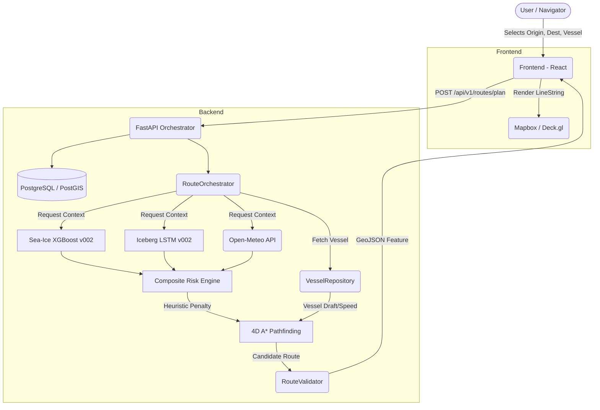
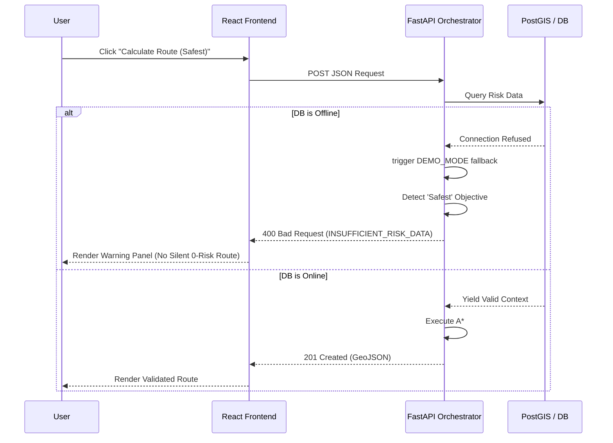

# SIH 26059: ARCHITECTURE & DATA FLOW
**Antarctic Navigation Decision Support System**

## 1. High-Level Data Flow Diagram (DFD)



## 2. Risk Aggregation Architecture

```mermaid
flowchart LR
    A[Iceberg LSTM Prediction] -->|Mean Haversine Error| B[CPA Geodesic Calc]
    B --> C[Iceberg Encounter Risk Index]
    
    D[Sea-Ice XGBoost Prediction] --> E[Sea-Ice Concentration Risk]
    
    C --> F{Max() Aggregation}
    E --> F
    
    F -->|Effective Spatial Risk| G[A* Edge Cost Function]
```

## 3. Fallback / Failure Sequence (UML)


