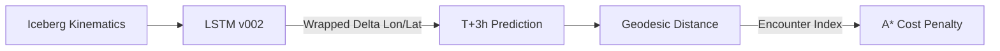
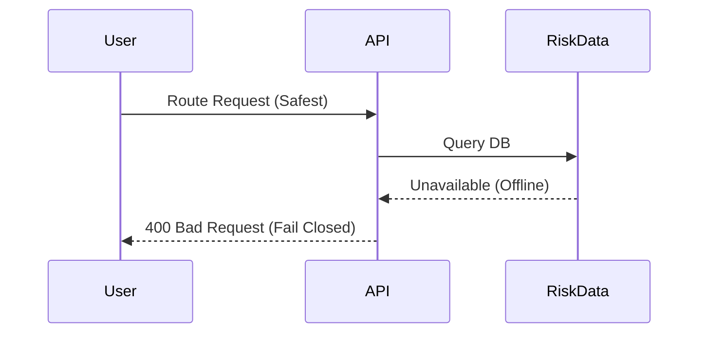

# SIH DIAGRAM SPECIFICATIONS
**Project:** SIH 26059

*These specifications are designed for importing into Mermaid.js or standard charting software.*

## 1. High-Level Architecture
```mermaid
flowchart TD
    UI[React Interface] -->|POST GeoJSON Request| API[FastAPI Orchestrator]
    API -->|Live Data Request| Environment[Sea-Ice XGBoost & Iceberg LSTM]
    Environment -->|Predicted Hazards| Risk[Risk Engine max()]
    Risk -->|Penalized Grid| Routing[4D Time-Aware A*]
    Routing -->|GeoJSON LineString| Validator[RouteValidator]
    Validator -->|Validated Route + Warnings| UI
```

## 2. Iceberg Prediction to CPA


## 3. Safest Fallback Sequence

